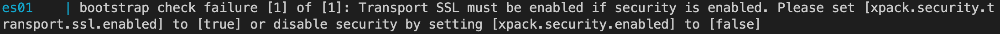

# k8s-docker-deployment

**k8s cluster or docker deployment document**

## single-redis

k8s deploy, redis is configured in ConfigMap

```
kubectl apply -f single-redis-conf.yaml
kubectl apply -f single-redis.yaml
```

****

## docker-single-rocketmq

[document](https://www.jianshu.com/p/6ad529a16677)

docker deploy rocketmq

deployment environment: linux/arm64

****

## docker-single-grafana-prometheus

目录下 prometheus.yml 文件为prometheus配置文件

[grafana模版地址](https://grafana.com/grafana/dashboards/)

可下载文档,在grafana中导入json文件，也可记录模版编号 在grafana中填写 系统自动加载

```
// 部署grafana命令
docker-composer -f grafana.yml up -d

```

****

## docker-single-loki

loki-local-config.yaml and promtail-config.yaml is configuration files

```
//deploy loki and promtail
docker-composer -f loki.yml up -d

//need deploy grafana refer to docker-single-grafana-prometheus/grafana.yml
```

****

## docker-multi-es

elasticsearch版本为7.17.9。 v8以上版本默认开启安全验证,不配置会报错


```
docker-composer -f es.yml up -d
```

#### reference document

- [阳明博客Grafana Loki简明教程](https://www.qikqiak.com/post/grafana-loki-usage/)

****

## docker-multi-clickhouse

```
docker-composer -f clickhouse.yml up -d
```

#### reference document
- [官方文档](https://clickhouse.com/docs)